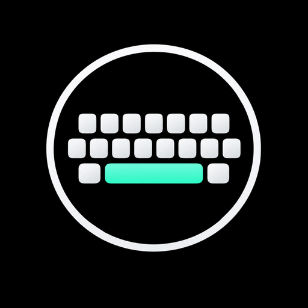

<p align="center">
  
</p>
> [!WARNING]
> ## 🚧 Application encore en développement
>
> **Keyra est actuellement en cours de développement actif.**
>
> Certaines fonctionnalités peuvent encore présenter des **bugs**, de petites **latences**, des comportements inattendus ou des différences selon l'appareil, la version d'Android ou l'application utilisée.
>
> Le projet évolue régulièrement afin d'améliorer la **fluidité**, la **précision de frappe**, la **stabilité**, les **suggestions** et la **correction de texte**.
>
> Si vous rencontrez un problème, n'hésitez pas à le signaler dans les **Issues GitHub** avec votre modèle de téléphone, votre version d'Android et une courte description du bug.
>
> **Merci de garder à l'esprit qu'il ne s'agit pas encore d'une version finale/stable.**
<h1 align="center">Keyra</h1>

<p align="center">
  Clavier Android open source conçu pour une frappe rapide, fluide, personnalisable et respectueuse de la vie privée.
</p>

<p align="center">
  <a href="https://github.com/0x80070006/Keyra_clavier_open_source/releases/download/v3.0/Keyra_v3.0.apk">
    
  </a>
  <a href="./PATCH_NOTES.md">
    
  </a>
</p>

<p align="center">
  <a href="https://github.com/0x80070006/Keyra_clavier_open_source/releases/tag/v3.0">Release GitHub v3.0</a>
  ·
  <a href="./PRIVACY.md">Confidentialité</a>
</p>

---

## À propos

**Keyra** est un clavier Android pensé autour de quatre priorités : **précision**, **réactivité**, **correction intelligente** et **personnalisation**.

Le moteur de saisie est conçu pour rester fiable lorsque l'utilisateur tape très vite, y compris lorsque plusieurs doigts touchent l'écran à quelques millisecondes d'intervalle. Les suggestions, la correction et les éléments visuels du clavier sont organisés pour ne pas interrompre le rythme de frappe.

> **Version actuelle : v3.0**

## Télécharger

### Android — APK

[**Télécharger directement Keyra v3.0 (.apk)**](https://github.com/0x80070006/Keyra_clavier_open_source/releases/download/v3.0/Keyra_v3.0.apk)

Le fichier APK est hébergé dans la release GitHub **v3.0**.

> Si Android bloque l'installation, autorisez temporairement l'installation d'applications provenant de votre navigateur ou de votre gestionnaire de fichiers. Le chemin exact dépend du fabricant et de la version d'Android.

## Fonctionnalités

### Saisie rapide et multi-touch

- Gestion des appuis rapprochés et des **multi-pointeurs Android**.
- Prise en charge des événements de type `ACTION_DOWN`, `ACTION_POINTER_DOWN`, `ACTION_POINTER_UP`, `ACTION_UP` et annulation de geste.
- État visuel des touches remis proprement à zéro après un appui rapide, un glissement, une interruption ou un `CANCEL`.
- Traitement renforcé autour de la **barre d'espace** pour éviter les lettres perdues pendant une frappe très rapide.
- Architecture pensée pour limiter le travail effectué sur le chemin critique de la saisie.

> La latence réelle dépend de l'écran tactile, du système Android, du taux de rafraîchissement, du matériel et de l'application active. Keyra vise une latence faible sans annoncer de valeur physique irréaliste.

### Suppression rapide

Un maintien sur **Suppr** déclenche une répétition accélérée afin d'effacer du texte rapidement, tout en gardant un appui simple précis.

### Majuscules

- Un appui sur **Maj** active la majuscule suivante.
- Un **double appui** sur Maj active le verrouillage des majuscules.
- Les variantes proposées lors d'un appui long respectent l'état des majuscules.

### Accents et variantes

Un appui long sur une lettre compatible ouvre un **mini panneau contextuel** au-dessus de la touche. Il peut contenir :

- la lettre d'origine ;
- ses variantes accentuées ;
- les variantes typographiques disponibles ;
- le chiffre ou symbole associé lorsque cela est pertinent.

Le panneau est dimensionné pour rester compact et proche de la touche maintenue.

### Suggestions et correction

Keyra intègre une barre de suggestions au-dessus du clavier avec pour objectifs :

- proposer des suggestions pour chaque mot ;
- tolérer certaines lettres manquantes ou frappes imparfaites ;
- mieux gérer les mots avec apostrophe ;
- normaliser les apostrophes droites (`'`) et typographiques (`’`) pendant l'analyse ;
- maintenir les suggestions disponibles même pendant une frappe rapide ;
- insérer une suggestion sélectionnée **avec un espace final** pour continuer à écrire immédiatement ;
- apprendre progressivement le vocabulaire utilisé par l'utilisateur, localement selon la configuration de l'application.

Exemples de fautes que le moteur cherche à mieux tolérer :

```text
vnir    → venir
maintn  → maintenant
j'aime  ↔ j’aime
```

### Retour haptique

Le retour haptique peut être activé ou désactivé dans les paramètres de Keyra.

### Thèmes et personnalisation

Keyra propose plusieurs options visuelles :

- thèmes intégrés ;
- couleurs personnalisées ;
- image de fond personnalisée ;
- flou gaussien du fond ;
- flou indépendant appliqué à la zone des touches ;
- intensités de flou différentes entre le fond et les touches afin de conserver une bonne lisibilité ;
- nouveau logo Keyra.

## Confidentialité

Un clavier peut avoir accès à du texte sensible : la confidentialité doit donc être traitée comme une fonctionnalité centrale.

Keyra est conçue avec les objectifs suivants :

- limiter au strict nécessaire le traitement des données saisies ;
- favoriser le traitement local pour la correction, les suggestions et le vocabulaire appris ;
- éviter qu'une connexion réseau soit nécessaire à la saisie normale ;
- conserver les préférences de thème et les images personnalisées sur l'appareil ;
- éviter la collecte de contenu tapé à des fins publicitaires ou de profilage.

Consultez la page dédiée : **[PRIVACY.md](./PRIVACY.md)**.

## Installation

1. Téléchargez l'APK avec le bouton **Télécharger Keyra v3.0**.
2. Ouvrez le fichier sur votre appareil Android.
3. Autorisez l'installation depuis cette source si Android le demande.
4. Ouvrez les réglages Android.
5. Accédez à la section **Langues et saisie / Clavier à l'écran / Gérer les claviers**.
6. Activez **Keyra**.
7. Sélectionnez Keyra comme clavier actif.

Le nom exact des menus peut varier selon la version d'Android et le fabricant.

## Mise à jour

Pour mettre Keyra à jour, installez l'APK d'une version plus récente par-dessus la version déjà installée, à condition que les builds utilisent la même signature Android.

Les versions publiées sont disponibles dans les **[GitHub Releases](https://github.com/0x80070006/Keyra_clavier_open_source/releases)**.

## Construire depuis les sources

Pour un projet Android/Gradle standard :

```bash
git clone https://github.com/0x80070006/Christian_clavier_open_source.git
cd Christian_clavier_open_source
./gradlew assembleDebug
```

Pour un build release :

```bash
./gradlew assembleRelease
```

Les tâches Gradle exactes peuvent varier si le projet contient plusieurs variantes ou modules.

## Principes techniques

Le clavier vise à garder le chemin de saisie aussi court que possible :

- séparation de l'état de chaque pointeur tactile ;
- gestion déterministe de l'état pressé/non pressé de chaque touche ;
- nettoyage systématique des highlights après fin ou annulation d'un contact ;
- calcul de suggestions hors du traitement immédiat des événements tactiles lorsque possible ;
- limitation des opérations coûteuses pendant `ACTION_DOWN` ;
- insertion directe dans le champ de texte actif via l'IME Android.

## Patch notes

Les changements de la version actuelle sont détaillés ici :

[**Lire les patch notes de Keyra v3.0**](./PATCH_NOTES.md)

La release GitHub correspondante est disponible ici :

[**Keyra v3.0 sur GitHub**](https://github.com/0x80070006/Keyra_clavier_open_source/releases/tag/v3.0)

## Contribuer

Les contributions sont bienvenues.

Flux conseillé :

```bash
git clone https://github.com/0x80070006/Christian_clavier_open_source.git
git checkout -b feature/ma-fonctionnalite
# modifications
git commit -m "feat: description claire"
git push origin feature/ma-fonctionnalite
```

Ouvrez ensuite une Pull Request en expliquant :

- le problème traité ;
- le comportement avant/après ;
- les appareils ou versions Android testés ;
- les éventuels impacts sur la latence, le multi-touch, la correction ou l'interface.

Pour les bugs de saisie, indiquez si possible :

- modèle de téléphone ;
- version Android ;
- fréquence d'écran ;
- application dans laquelle le problème apparaît ;
- séquence de touches reproduisant le problème ;
- présence de plusieurs doigts à l'écran.

## Signaler un bug

Utilisez les **[GitHub Issues](https://github.com/0x80070006/Keyra_clavier_open_source/issues)** avec une procédure de reproduction courte et précise.

Pour les problèmes de lettres perdues ou de touches qui restent en surbrillance, précisez notamment si le bug apparaît :

- pendant une frappe extrêmement rapide ;
- autour d'un appui sur Espace ;
- avec deux doigts presque simultanés ;
- après un glissement ou un geste annulé ;
- après un appui long.

## Projet

- **Application :** Keyra
- **Plateforme :** Android
- **Version :** v3.0
- **Dépôt :** https://github.com/0x80070006/Keyra_clavier_open_source
- **Release :** https://github.com/0x80070006/Keyra_clavier_open_source/releases/tag/v3.0
- **APK :** `Keyra_vx.x.apk`

---

<p align="center">
  <strong>Keyra — rapidité, précision et personnalisation.</strong>
</p>
